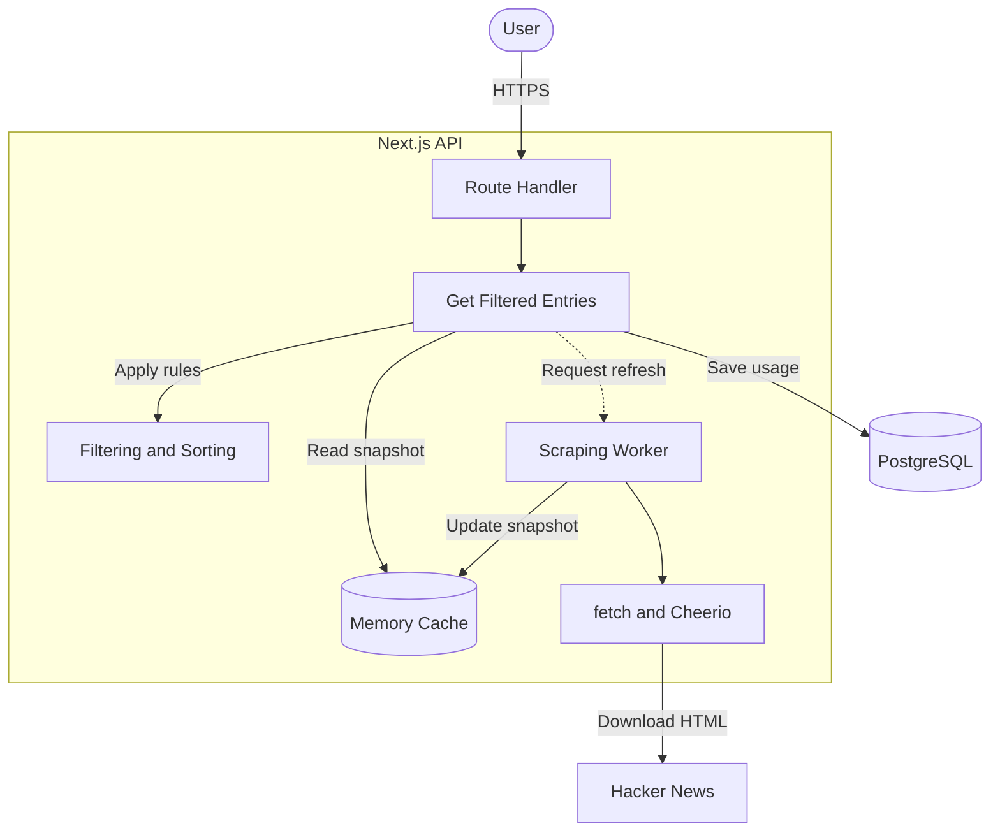

# Containers[C2] and Components[C3] Diagram

- The API and PostgreSQL are containers.
- The worker, cache, and filtering logic add C3 detail inside the API.

```mermaid
flowchart TD
    User([User]) -->|HTTPS| Route

    subgraph API["Next.js API"]
        Route[Route Handler] --> Query[Get Filtered Entries]
        Query -->|Read snapshot| Cache[(Memory Cache)]
        Query -->|Apply rules| Filters[Filtering and Sorting]
        Query -.->|Request refresh| Worker[Scraping Worker]
        Worker --> Scraper[fetch and Cheerio]
        Worker -->|Update snapshot| Cache
    end

    Query -->|Save usage| DB[(PostgreSQL)]
    Scraper -->|Download HTML| HN[Hacker News]
```
